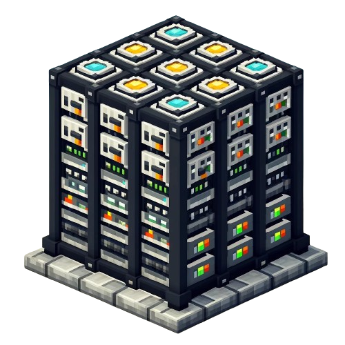

<br />
<div align="center">
  <a href="https://discord.com/users/216487432667791360">
    
</a>
</div>

  <h3 align="center">Energetic Storage Reborn</h3>

Energetic Storage Reborn is a plugin that is heavily inspired by the forge mods
named [Applied Energistics 2](https://www.curseforge.com/minecraft/mc-mods/applied-energistics-2)
and [Refined Storage](https://www.curseforge.com/minecraft/mc-mods/refined-storage).
If you don't know what Applied Energistics 2 is, it's a mod that allows the player to store large numbers of items,
sometimes hundreds of thousands, in just a few blocks.

Energetic Storage Reborn is a complete recode for Minecraft 1.20.6 of the original [Energetic Storage](https://github.com/SeanOMik/EnergeticStorage).
It is significantly more modern,
designed exclusively for PaperMC, Java 21, Kotlin, and Minecraft 1.20.6+,
utilizing the latest features the game has to offer.
It is also designed to be more efficient and more user-friendly than the original while adding new features
and improvements.

If you run into any issues,
[create a GitHub issue!](https://github.com/CoasterFreakDE/EnergeticStorage-Reborn/issues/new)

---

## Features:
* [ ] Hopper Input
* [ ] Terminal Sorting
* [ ] Player/Region Whitelist
  * [ ] Lands Integration
* [ ] Support for 1.20.6


## Items And Blocks:
* 1k, 4k, 16k, and 64k, drives
  * The drives are needed to store items. 1k can store 1024 items, 4k can store 4096 and so on (1024 * how many thousand).
  * All drives have a type limit set at 32, 64, 128 or 256. This means that only this amount of different item types can be added to a single drive.
    * Can be changed in config.
* ES System
    * The ES System is what keeps the drives inside it and is used to access the items stored on the drives.
    * You can trust players into the system; they will have just as much access as you do.
        * Only the system owner can trust players.
    * If you have Lands installed, you can trust areas to access the system.
    * Public ES Systems:
        * **_Anybody_** will have access to take items from the system.
        * Only trusted players and the owner of the system can destroy it.

## Permissions
* `energeticstorage.*`: Gives all Energetic Storage permissions. Default: `op`
* `energeticstorage.reload`: Gives permission to reload the Energetic Storage configuration files. Default: `op`
* `energeticstorage.esgive`: Gives permission to give an Energetic Storage item to themselves. Default: `op`
* `energeticstorage.esgive.others`: Gives permission to give an Energetic Storage item to others. Default: `op`
* `energeticstorage.system.open.untrusted`: Gives permission to open an ES System that the player is not trusted on. Default: `op`
* `energeticstorage.system.create`: Gives permission to create an ES System. Default: `Everyone`
* `energeticstorage.system.destroy.untrusted`: Gives permission to destroy a system the player isn't trusted on. Default: `op`

## Commands
* /esreload
* /esgive [drive/system] [1k, 4k, 16k, 64k] (player)

## Config:
Config.yml:
```yaml
drives:
  # Sets the drives max type limit.
  SMALL:
    diskName: "1k Disk"
    items: 1024
    types: 64
  MEDIUM:
    diskName: "4k Disk"
    items: 4096
    types: 128
  LARGE:
    diskName: "16k Disk"
    items: 16384
    types: 256
  XLARGE:
    diskName: "64k Disk"
    items: 65536
    types: 512

storage:
  # The storage type to use. Options: "mysql", "mariadb"
  type: "mariadb"
  host: "localhost"
  port: 3306
  database: "energeticstorage"
  username: "root"
  password: "password"
```
---

<p align="center">
<br />
<br />
<a href="https://liamxsage.com">Website</a>
·
<a href="https://discord.com/users/216487432667791360"><strong>Contact</strong></a>
</p>

